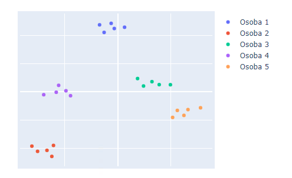

# Cvičení 2 - Vizualizace dat a t-SNE

Cílem cvičení je vyzkoušet si základní vizualizaci dat, redukci dimenze metodou t-SNE a spustit ji na větším datasetu na MetaCentru. Úlohy 1 a 2 zvládnete na vlastním počítači, úlohu 3 je potřeba spočítat na MetaCentru.

Potřebné knihovny: `numpy`, `matplotlib`, `plotly`, `scikit-learn`, `pickle`

## Úloha 1 - Základní vizualizace

Vykreslete jednoduchý sloupcový graf s hodnotami `[1, 2, 3]`, jednou pomocí knihovny Matplotlib a jednou pomocí knihovny Plotly.

## Úloha 2 - t-SNE na x-vektorech

V souboru `data.pk` jsou uloženy tzv. vektory mluvčích (x-vektory), které se často využívají při verifikaci mluvčího. Pokud tyto vektory fungují správně, měly by se vektory stejné osoby ve vizualizaci shlukovat a zároveň být dostatečně vzdálené od vektorů ostatních osob.

1. Načtěte data uložená pomocí knihovny `pickle` jako tuple `(data, Y)`. Soubor je potřeba otevřít binárně.
    - `data` je list vektorů 5 osob, celková velikost je (25, 128),
    - `Y` obsahuje labely osob pro jednotlivé vektory (0, 0, 0, 0, 0, 1, 1, ...).
2. Redukujte dimenzi dat do 2D pomocí `sklearn.manifold.TSNE`. Doporučuji přečíst si [dokumentaci](https://scikit-learn.org/stable/modules/generated/sklearn.manifold.TSNE.html), hlavně k parametru `perplexity`.
3. Vizualizujte vektory ve 2D pomocí knihovny Plotly, body obarvěte podle osoby.

Výsledek by měl vypadat přibližně takto:



## Úloha 3 - t-SNE na velkých datech (MetaCentrum)

Na 25 vektorech proběhne t-SNE okamžitě, na větších datech je to ale jinak. Použijte dataset MNIST (obrázky číslic 28 × 28, tj. vektory o dimenzi 784) a vezměte z něj prvních 30 000 obrázků:

```python
from sklearn.datasets import fetch_openml

X, y = fetch_openml("mnist_784", version=1, as_frame=False, return_X_y=True)
X, y = X[:30000], y[:30000]
```

Spočítejte t-SNE s parametrem `method="exact"`, který počítá přesně vzdálenosti mezi všemi dvojicemi bodů. Výsledek vykreslete do 2D a body obarvěte podle číslice. Graf uložte do souboru (např. `plt.savefig("mnist_tsne.png")`) a vypište, jak dlouho výpočet trval.

Na tolika bodech potřebuje výpočet přes 20 GB paměti a běží několik hodin, proto ho spusťte na MetaCentru jako dávkovou úlohu stejně jako v minulém cvičení. V PBS skriptu si vyžádejte dostatek paměti (`mem`) a času (`walltime`).

## Bonus

Bonusový bod je za malou vlastní analýzu dat, ne za samotné grafy. Dataset si vyberte sami, např. z:
- [Stanford Large Network Dataset Collection](http://snap.stanford.edu/data/index.html) (sociální sítě, citační sítě, sítě silnic, ...),
- [Kaggle Datasets](https://www.kaggle.com/datasets),
- [UCI Machine Learning Repository](https://archive.ics.uci.edu/).

Požadavky:
1. Dataset nesmí být z tohoto cvičení ani žádný z „učebnicových“ (Iris, Titanic, MNIST, Boston Housing apod.).
2. Na začátku formulujte 1-2 otázky, na které chcete z dat odpovědět (např. *„Tvoří uživatelé této sociální sítě oddělené komunity?“*).
3. Vytvořte alespoň 3 vizualizace, z toho alespoň 2 musí vyžadovat netriviální výpočet nad daty (viz příklady níže). Obyčejný sloupcový, čárový nebo bodový graf několika sloupců tabulky se do nich nepočítá.
4. Pod každou vizualizaci napište, co z ní je vidět, a na konci shrňte odpověď na vaše otázky.

Příklady vizualizací s netriviálním výpočtem:
- **síť s komunitami** (knihovna `networkx`): detekce komunit, velikost uzlů podle stupně, barva podle komunity,
- **rozdělení stupňů uzlů** v log-log měřítku porovnané s náhodným grafem se stejným počtem uzlů a hran,
- **animace vývoje v čase** v Plotly (posuvník nebo přehrávání), např. jak se mění agregované hodnoty po letech,
- **mapa** s daty agregovanými po regionech (`plotly.express.choropleth`),
- **redukce dimenze** (PCA, t-SNE, UMAP) vlastních dat a porovnání metod vedle sebe,
- **shlukování** (např. k-means) a porovnání nalezených shluků se skutečnými třídami.

## Odevzdání

Do svého repozitáře nahrajte složku `cv02`, která bude obsahovat:
- Jupyter notebook s úlohami 1 a 2,
- Python skript a PBS skript z úlohy 3,
- výstupní logy úlohy z MetaCentra,
- výsledný graf z úlohy 3,
- (volitelně) notebook s bonusovou analýzou.
